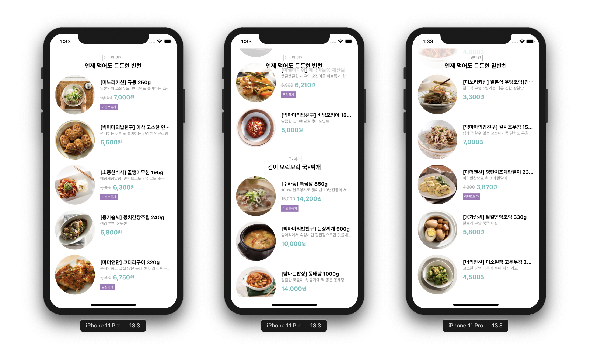
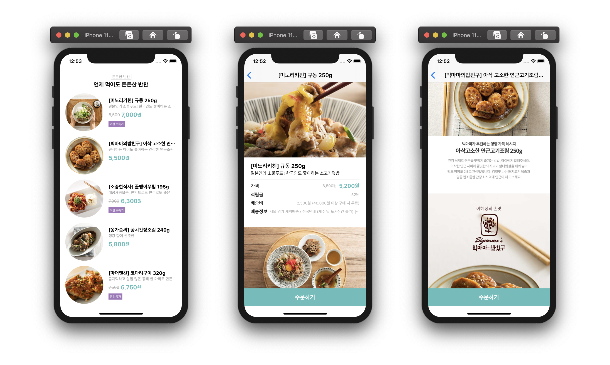

# Side Dish iOS

코드스쿼드 반찬 서비스 iOS 앱

## 단계별 구현 내용

### 메인페이지 구현

> [PR #37 [iOS] 메인페이지 구현][pr37]

* 스토리보드로 커스텀 테이블뷰 셀, 커스텀 헤더 뷰 구현
* 테이블 뷰에 표시할 모델을 갖고있는 뷰모델과, 테이블 뷰 셀에 표시할 모델을 갖고있는 뷰모델 구현
* 테이블 뷰 셀에 반찬 이미지, 뱃지 등 정보 표시
* 바뀐 테이블뷰 section만 업데이트하도록 개선

Related issues: [#8][issue8] and [#13][issue13]

**실행 결과**

#### 피드백을 통해 개선한 내용

* 셀 뷰모델 바인딩 삭제하고, 데이터소스에서 셀을 그리도록 개선
* Mock API가 아닌 실제 서버로 연결
* 배지 정보를 서버에서 보내준대로 표시
* `downloadTask`를 이용하여 이미지 캐싱 구현
* 뷰모델 업데이트와 뷰 업데이트를 순차적으로 하기 위해 sync 이용

Related issues: [#44][issue44] and [#58][issue58]

### 반찬 상세 정보 페이지 구현

* 스토리보드로 세로 스크롤뷰 및 페이징 스크롤뷰 등 구현
* 서버에 반찬 상세 정보 요청 및 정보 표시
* 이미지 컬렉션을 관리하는 ImageCollection 뷰모델 구현

Related issues: [#60][issue60]

**실행 결과**

[pr37]: https://github.com/codesquad-member-2020/sidedish-12/pull/37

[issue8]: https://github.com/codesquad-member-2020/sidedish-12/issues/8
[issue13]: https://github.com/codesquad-member-2020/sidedish-12/issues/13
[issue44]: https://github.com/codesquad-member-2020/sidedish-12/issues/44
[issue58]: https://github.com/codesquad-member-2020/sidedish-12/issues/58
[issue60]: https://github.com/codesquad-member-2020/sidedish-12/issues/60
