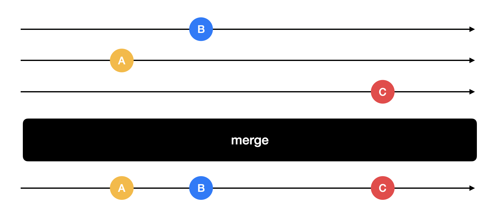
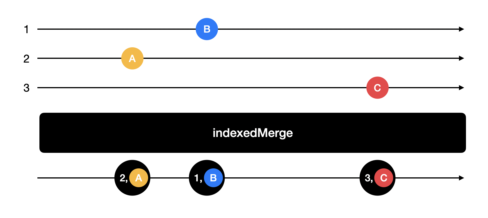

# RxSideDish

코드스쿼드 반찬 서비스 iOS 앱 RxSwift 리팩토링

<p align="center"></p>

## 목차

- [리팩토링 내용 정리](#리팩토링-내용-정리)
    - [메인페이지 ViewModel Output Binding하기](#1주차--메인페이지-ViewModel-Output-Binding하기)
        - [RxCocoa TableView 리서치](#RxCocoa-TableView-리서치)
        - [RxDataSource 리서치](#RxDataSource-리서치)
        - [테이블뷰 섹션 업데이트 트러블슈팅](#테이블뷰-섹션-업데이트-트러블슈팅)
    - [Networking Layer 리팩토링](#Networking-Layer-리팩토링)
        - [Merge 연산자의 순서 처리 문제 해결](#Merge-연산자의-순서-처리-문제-해결)
- [References](#References)

## 리팩토링 내용 정리

### 메인페이지 ViewModel Output Binding하기

- 테이블뷰 섹션별로 업데이트 기능 리팩토링
- 테이블뷰 셀 선택 시 화면 전환 기능 리팩토링

#### RxCocoa TableView 리서치

RxCocoa에서는 테이블뷰 델리게이트의 여러 이벤트들에 대한 reactive wrapper를 제공한다. [UITableView+Rx.swift][UITableView+Rx]

- `tableView:didSelectRowAtIndexPath:` → `itemSelected`
- `tableView:didDeselectRowAtIndexPath:` → `itemDeselected`

`modelSelected(_:)`, `modelDeselected(_:)`는 테이블뷰의 선택/취소된 row에 해당하는 모델 객체를 방출한다. item* 메서드는 바인드 없이 사용 가능한데, model* 메서드들은 다음과 같이 테이블뷰에 데이터를 바인드하는 작업 후에 사용이 가능하다.

```swift
Observable.of(["Lisbon", "Copenhagen", "London", "Madrid", "Vienna"])
    .bind(to: tableView.rx.items) { (tableView, row, element) in
        let cell = tableView.dequeueReusableCell(withIdentifier: "Cell")!
        cell.textLabel?.text = element
        return cell
    }
```

하지만 [UITableView+Rx.swift][UITableView+Rx]과 [RxTableViewReactiveArrayDataSource.swift][RxTableViewReactiveArrayDataSource]를 살펴보면 RxCocoa에서 제공하는 `tableView.rx.items`는 테이블뷰의 섹션이 하나일 때만 사용이 가능한 것으로 확인된다.

#### RxDataSource 리서치

RxDataSource를 사용하면(Dependency 추가 필요) 여러 개의 섹션을 가진 테이블뷰에 데이터를 바인딩 가능하며, 데이터의 변경된 부분을 자동으로 알아내어 추가되거나 삭제되는 애니메이션도 알아서 처리해준다.

[RxDataSource][RxDataSource]의 Example 프로젝트를 살펴본 결과,

예를 들어 테이블뷰의 itemDeleted 이벤트(RxCocoa 제공)를 받아 모델을 변경(개발자가 구현 필요) 후 `tableView.rx.items(dataSource:)`에 바인드하는 스트림을 만들면 자동으로 변경된 부분을 찾아서 업데이트 해주며, 선택적으로 애니메이션 표시가 가능하다.

- 하지만 학습을 위해서 일단은 추가 라이브러리이니 RxDataSource를 사용하지 않고, 뷰모델에서 특정 섹션 업데이트에 대한 observable를 제공하도록 구현한 뒤에 이 이벤트를 받아서 직접 `tableView.reloadSections()`에 연결해 볼 예정
- 구현해야 하는 테이블뷰가 여러 section을 갖고 있어서 RxCocoa에서 제공해주는 테이블뷰에 데이터를 바인딩하는 기능도 사용할 수 없으므로 UIKit의 UITableViewDataSource를 그대로 사용하고, 바인딩 없이 사용 가능한 `tableView.rx.itemSelected`만 사용 예정

#### 테이블뷰 섹션 업데이트 트러블슈팅

현재 `main`, `soup`, `side` 3가지 API 요청 후 응답이 오면 온 순서대로 모델 업데이트 후 테이블뷰의 해당 섹션 reload 요청을 한다. 예를 들어 `main`에 대한 응답이 오면 모델에 데이터를 추가 후 섹션 0번을 reload하여 테이블뷰에 보여준다.

하지만 테이블뷰의 경우 reload 요청을 하지 않은 섹션의 모델이 바뀌어 있으면 invalid update 에러가 발생한다.


위 그림에서와 같이, 테이블뷰 섹션 0, 1, 2번 중 Response C에 해당하는 테이블뷰의 섹션 2번을 reload 요청했는데, Response A 때문에 섹션 0번에 해당하는 모델도 변경되어 있어서 크래시가 발생한다.

다음 그림과 같이 API 응답에 따른 모델 변경과 애니메이션을 동기적으로 처리하여 해결하려고 시도했다.


##### ConcatMap 사용 시도

API 응답에 따른 모델 변경과 애니메이션을 동기적으로 처리하기 위해 ConcatMap을 사용하여 이전 옵저버블의 onCompleted가 호출된 후 다음 옵저버블을 실행해보려 하였다.

```swift
extension Reactive where Base: UITableView {

    func reloadSections(
        _ sections: IndexSet,
        with rowAnimation: UITableView.RowAnimation
    ) -> Observable<Void> {
        return Observable.create { observer in
            CATransaction.begin()
            CATransaction.setCompletionBlock {
                observer.onCompleted()
            }
            self.base.reloadSections(sections, with: rowAnimation)
            CATransaction.commit()
            return Disposables.create()
        }
    }
}

// tableView.rx.reloadSections()
```

다음과 같이 `concatMap`을 이용하여 애니메이션이 끝난 후 onCompleted가 방출되어 다음 뷰모델 업데이트를 처리할 수 있도록 하려 했다.

```swift
Observable.concatMap {
    // viewModel update 1, reload section 1, viewModel update 0, reload section 0, ...
}
```

하지만 뷰모델을 업데이트할 옵저버블들은 concatMap을 호출하는 시점에 한 번에 만들 수 없고, API 응답이 올때 데이터가 생겨서 만들 수 있게 되므로 실패. 또한 어떤 API 응답이 먼저 올지도 concatMap을 호출하는 시점엔 모른다. 작업이 들어올 때마다 시리얼 큐에 저장하여 순서대로 실행하는 방향이 더 적합하다는 생각이 들었다.

##### SerialDispatchQueueScheduler 사용하여 해결

```swift
// 시리얼 큐
private let queue = DispatchQueue(label: "sidedish.networking")

// 테이블뷰 section update 알림 구독
viewModel?.sectionUpdate
    .subscribeOn(SerialDispatchQueueScheduler(queue: queue, internalSerialQueueName: "update"))
    .catchErrorJustReturn(IndexSet(0..<0))
    .subscribe(onNext: { [weak self] in self?.reloadSynchronously(self?.tableView, at: $0) })
    .disposed(by: disposeBag)

// 테이블뷰 Reload
private func reloadSynchronously(_ tableView: UITableView?, at indexSet: IndexSet) {
    DispatchQueue.main.sync { tableView?.reloadSections(indexSet, with: .automatic) }
}

// 네트워크 응답 도착 시 뷰모델 업데이트
private func fetchSideDishes() {
    SideDishUseCase().fetchSideDishes { index, sideDishes in
        self.queue.sync {
            self.viewModel?.update(category: index, sideDishes: sideDishes)
        }
    }
}
```

시리얼 큐를 하나 만들고, 발행을 이 큐에서 하도록 `subscribeOn`을 사용하여 설정했다. onNext 이벤트에서는 동기적으로 뷰를 업데이트하는 메서드를 호출한다. 백그라운드 스레드에서 이벤트가 발행되므로 백그라운드 스레드에서 이 메서드를 호출하며, 이 메서드 안에서 reload 애니메이션은 메인 스레드에 sync로 보내진다.

이렇게 하면 테이블뷰 reload 애니메이션이 끝날 때까지 백그라운드 스레드가 blocking되어 다음 뷰모델 변경작업을 수행하지 않는다.

UI 바인딩 기능이지만 백그라운드 스레드에서 동작해야 해서 Driver를 사용하지 않았으므로 에러가 났을 때 스트림이 끊기지 않도록 에러 처리도 추가하였다.

### Networking Layer 리팩토링

- URLSession을 이용해 서버에 데이터를 요청하고 응답받는 APIDispatcher와, APIDispatcher를 이용해 받은 데이터를 디코딩하는 역할의 APITask를 callback 방식 대신 Observable을 생성해 리턴하는 방식으로 개선

#### Merge 연산자의 순서 처리 문제 해결

위 [테이블뷰 섹션 업데이트 트러블슈팅](#테이블뷰-섹션-업데이트-트러블슈팅)에 설명한 대로, 메인 페이지에서는 `main`, `soup`, `side` 3가지 API 요청 후 응답이 오면 모델을 변경하고 해당 테이블뷰 section을 reload해야 한다.



하지만 위 그림과 같이 RxSwift의 merge 연산자를 사용할 경우, 방출된 데이터가 몇 번째 순서의 Observable로부터 온지 몰라서 네트워크 응답이 왔을 때 어떤 섹션에 들어가야 하는지 모르는 문제가 발생하였다.

이 문제를 해결하기 위해 데이터 A가 도착했을 때 몇 번째 Observable로부터 방출되었다는 정보가 같이 와서 해당하는 테이블뷰의 섹션을 업데이트하는 게 좋겠다는 생각이 들었다.

##### indexedMerge 커스텀 연산자 구현

연산자에 입력되는 Observable의 순서대로 번호를 붙이고, 원본 데이터를 번호와 함께 리턴하는 연산자를 구현하여 문제를 해결하였다.

```swift
struct IndexedElement<E> {
    
    let index: Int
    let element: E
}

extension ObservableType {
    
    static func indexedMerge<Payload>(
        _ sources: [Observable<Payload>]
    ) -> Observable<Element> where Element == IndexedElement<Payload> {
        let observables = sources.enumerated().map { index, source in
            source.map { IndexedElement(index: index, element: $0) }
        }
        return Observable.merge(observables)
    }
}
```

기존 RxSwift에 구현된 연산자들처럼 ObservableType을 확장하여 메서드를 추가하였다. `Payload`는 입력한 옵저버블들이 방출하는 원본 데이터를 의미하며, 리턴 타입은 `Payload`를 `IndexedElement` 타입으로 감싼 `IndexedElement<Payload>`이다.

또한 기존 merge 연산자에 `IndexedElement<Payload>` 타입을 입력하여 사용하기 위해 
`ObservableType`의 내부적으로 사용하는 `Element` 타입이 `IndexedElement<Payload>`와 같다고 명시하였다.

이 메서드는 아래 그림처럼 연산자에 입력된 순서를 기록한 후 merge하여 돌려준다.



#### ObserverType, AnyObserver와 Bind 리서치

뷰모델의 input을 AnyObserver 타입으로 바꾸고 외부에서 이 input에 바인딩하기 위해 관련 객체들을 분석하고 구현 내용을 살펴보았다.

[ObserverType.swift][ObserverType]에 ObserverType 프로토콜이 구현되어 있다.

```swift
public protocol ObserverType {

    associatedtype Element

    func on(_ event: Event<Element>)
    // ...
}
```

`Event`는 next, error, completed를 case로 갖는 enum이다. 옵저버블들은 이 ObserverType을 따르는 Observer들의 메서드 `on`를 호출하면서 `Event`의 case와 함께 연관 값으로 Element, Error 등을 전달하는 방식으로 이벤트를 전달할 수 있다.

[AnyObserver.swift][AnyObserver]에는 ObserverType을 따르는 AnyObserver가 구현되어 있다.

```swift
public struct AnyObserver<Element> : ObserverType {

    public typealias EventHandler = (Event<Element>) -> Void

    private let observer: EventHandler

    public func on(_ event: Event<Element>) {
        return self.observer(event)
    }
    // ...
}
```

AnyObserver는 이벤트 핸들러 클로저를 갖고 있다가 `on`이 호출되면 이 클로저를 invoke하며 이벤트를 넘겨준다.

[Observable+Bind.swift][Observable+Bind]는 RxCocoa에 포함되어 있으며, ObservableType을 확장한 bind 기능이 구현되어 있다.

```swift
extension ObservableType {

    private func bind<Observer: ObserverType>(to observers: [Observer]) -> Disposable where Observer.Element == Element {
        return self.subscribe { event in
            observers.forEach { $0.on(event) }
        }
    // ...
}
```

`bind`는 `subscribe`를 간소화하여 가독성을 좋게 사용하기 위한 extension이다. ObservableType을 확장했으므로 자기 자신의 subscribe를 호출하며 observer에게 이벤트를 전달한다.

```swift
viewModel.#Observable#
    .subscribe(onNext: { item in
        // viewModel.observer에 이벤트 전달
    })
    .disposed(by: disposeBag)

viewModel.#Observable#
    .bind(to: viewModel.#AnyObserver#)
    .disposed(by: disposeBag)
```

위와 같이 코드를 간결하게 개선할 수 있다.

## References

- [스터디 진행 스프레드시트][spreadsheet]
- [RxSwift/UITableView+Rx.swift][uitableview+rx]
- [RxTableViewReactiveArrayDataSource.swift][RxTableViewReactiveArrayDataSource]
- [RxDataSources][RxDataSources]
- [ObserverType.swift][ObserverType]
- [AnyObserver.swift][AnyObserver]
- [Observable+Bind.swift][Observable+Bind]

[spreadsheet]: https://docs.google.com/spreadsheets/d/1b7fGROHrgzJ80YjxaaAlRoj1XyLpZCFHk5xeK-yKW4I/edit#gid=0
[UITableView+Rx]: https://github.com/ReactiveX/RxSwift/blob/master/RxCocoa/iOS/UITableView%2BRx.swift
[RxDataSources]: https://github.com/RxSwiftCommunity/RxDataSources
[RxTableViewReactiveArrayDataSource]: https://github.com/ReactiveX/RxSwift/blob/master/RxCocoa/iOS/DataSources/RxTableViewReactiveArrayDataSource.swift
[ObserverType]: https://github.com/ReactiveX/RxSwift/blob/main/RxSwift/ObserverType.swift
[AnyObserver]: https://github.com/ReactiveX/RxSwift/blob/main/RxSwift/AnyObserver.swift
[Observable+Bind]: https://github.com/ReactiveX/RxSwift/blob/main/RxCocoa/Common/Observable%2BBind.swift


